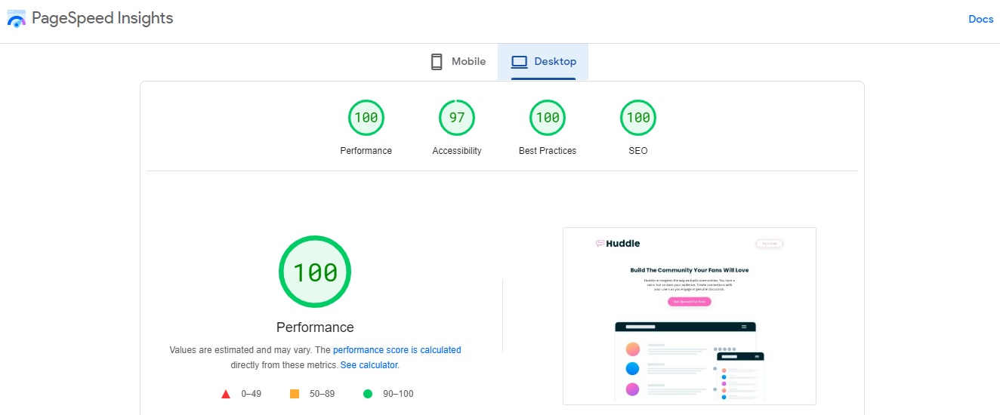

# Frontend Mentor - Huddle landing page with curved sections solution by WebDev Mirza

This is a solution to the [Huddle landing page with curved sections challenge on Frontend Mentor](https://www.frontendmentor.io/challenges/huddle-landing-page-with-curved-sections-5ca5ecd01e82137ec91a50f2).

## Table of contents

- [Performance Test](#performance-test)
- [Screenshot](#screenshot)
- [What I've Learnt](#what-ive-learnt)
- [Willing To Reach Advanced Goals](#willing-to-reach-advanced-goals)
- [Author](#author)
- [Date](#date)

## Performance Test

## Screenshot

### Desktop

### Mobile

## What I've Learnt

- Use of .woff fonts for improving page loading.
- Use of css @container query.

## Willing To Reach Advanced Goals

- float css property

## Author

- Mirza Monirul Alam
- Frontend Mentor - [@WebDevMirza](https://www.frontendmentor.io/profile/WebDevMirza)

## Date

- 2 February 2023
